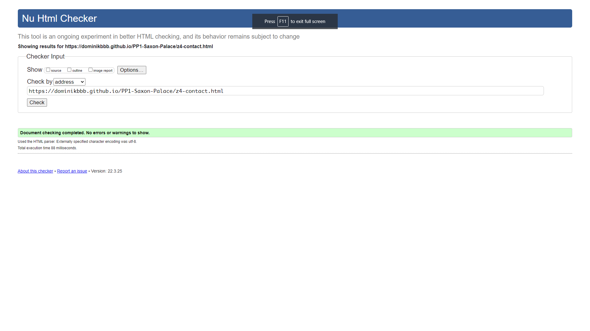
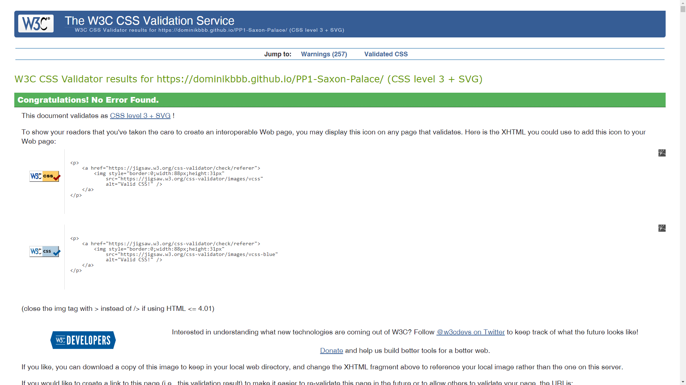

  

# The Old-New Saxon Palace in Warsaw

## by DB

---

  

---

This is my Portfolio Project 1 (PP1) which is a part of the Code Institute’s Full Stack Software Development Diploma Course. This project demonstrates the skills and knowledge of the HTML, CSS, Bootstrap 5 and User Centric Frontend Development modules which I have learned recently during the course.

#### [Click here to view the site.](https://dominikbbb.github.io/PP1-Saxon-Palace/)
#### [Click here to view the repository.](https://github.com/DominikBBB/PP1-Saxon-Palace)

---

# Table of Contents:

1. [Project Overview](#project-overview) +
2. [User Experience(UX)](#user-experience-ux) +
    1. [Target Audience](#target-audience) +
    2. [User Stories](#user-stories) +
    3. [Strategy](#strategy) +
    4. [Scope](#scope) +
    5. [Structure](#structure) +
    6. [Skeleton](#skeleton) +
        1. [Wireframes](#wireframes) +
        2. [Mockups](#mockups) +
    7. [Surface](#surface) +
        1. [Colours](#colours) +
        2. [Typography](#typography) +
        3. [Images & Icons](#images-&-icons) +
3. [Features](#features) +
    1. [Existing Features](#existing-features) +
    2. [Future Features](#future-features) +
4. [Technologies](#technologies) +
    1. [Languages](#languages) +
    2. [Other Technologies](#other-technologies) +
    3. [Resources](#Resources) +
5. [Testing](#testing) +
    1. [Tests](#tests) +
        1. [HTML/CSS](#html-css) +
        2. [Manual testing Browser testing](#manual-testing-browser-testing) +
        3. [Performance Testing](#performance-testing)
        4. [Visual testing](#visual-testing) +
        5. [Funcionality testing](#funcionality-testing) +
        6. [Testing User Stories](#testing-user-stories) +
    2. [Bugs and Fixes](#bugs-and-fixes) +
6. [Deployment](#deployment) +
    1. [GitHub Pages](#github-pages) +
    2. [Forking Repository](#forking-the-github-repository) +
    3. [Cloning the project](#cloning-the-project) +
7. [Credits](#credits) +
8. [Acknowledgments](#acknowledgments) +

---

# Project Overview:

The Old-New Saxon Palace website is a landing page for people interested in the historical facts of The Saxon Palace in Warsaw.
Users will be able to understand why the Palace was established, rebilt, renovated, sold, bought, occupied and destroyed. User will also see proposal and videos how the Saxon Palace will be restored. This website will present the history of the palace in timeline order and in extensive photo gallery. Users will be able to find links to social media platforms and contact information and also the contact form to send the message if they need more information or just sign up for a newsletter.

This website will target all people, both local residents and turists, who want to explore past, present and future facts about the Old-New Saxon Palace.

[Back to Table Of Contents](#table-of-contents)

---

# User Experience UX:

## Target Audience:

- History enthusiasts,
- Tourists,
- Local residents in Warsaw,
- People of all ages.

[Back to Table Of Contents](#table-of-contents)

## User Stories:

- First time user:

  1. As a user I would like to quickly know what the Saxon Palace in Wasaw is,
  2. As a user I would like to be able to see pictures, video and locate the place on the maps,
  3. As a user I want the application to be easy to navigate / single-use learning.

- Returning User:

  1. I would want to be able to navigate the site with ease,
  2. I would want to be able to learn about historical facts in details,
  3. I would want to and stay in touch with the promotor of the site.

- As a site creator:

  1. I want to make the site user friendly,
  2. I want to make sure the user finds complex evidence-based information,
  3. I want to ensure there are enough text and media information to prevent the user from becoming bored,
  4. I want to provide easy access to the promotor to submit questions.

[Back to Table Of Contents](#table-of-contents)

## Strategy:

### Project Goals:

My goal in this project is to promote the Saxon Palace in Warsaw to the market to allow the users learn about history of the Palace and to raise the awareness of the purpose of the reconstruction. 

### Business Goals:

1. Promote the Saxon Palace and its surroundings,
2. Encourage visitors to explore this historical place,
3. Provide useful information about Old Saxon Palace and its reconstruction,
4. Provide the contact form, so the users will be able to send enquiries,
5. Include short video to promote New Saxon Palace,
6. Include the map with the location of Old Saxon Palace.

### Customer Goals:

1. Easy to find information about The Saxon Palace in Warsaw,
2. Easy to use application on mobile devices with user-friendly site navigation,  
3. Easy to find more information through links to social media,
4. Easy to find contact form for sending enquiries.

[Back to Table Of Contents](#table-of-contents)

## Scope:

#### The scope of The Old-New Saxon Palace page in its first release is defined by the following features:

- Fully responsive design website,
- An About Section which presents information about The Saxon Palace,
- A History Section which include timeline with complex history facts about The Palace,
- A Gallery Section which shows a list of photos that are related to the history of the palace,
- A Contact Section with address and contact form,
- An easy to navigate interface.

#### Features that are to be considered for future releases:

- Dark mode,
- Maps,
- Videos,
- Polish language version.

[Back to Table Of Contents](#table-of-contents)

## Structure:

The structure for the webpage has been thought out and designed to allow for the user to have a seamless and easy experience. A consistent minimalistic design will be implemented on all pages. The flow of the pages will feel natural and allow for the user to feel right at home after only viewing one page.

[Back to Table Of Contents](#table-of-contents)

## Skeleton:

### Wireframes:

 

[Back to Table Of Contents](#table-of-contents)

### Mockups:

[Back to Table Of Contents](#table-of-contents)

## Surface:

### Colours:

The colours that will be used throughout the site for its main styling are shown below, these colours have been picked to keep within the design brief of maintaining a simplified viewing pleasure.

The colours will be used in specific ways that complement one another:
- Lavender Grey (#C7C7D1) for backgroud,
- Cultured (#F4F4F6) for text,
- Rich Black Forga39 (#0E0E10) for text,
- Sunset Orange (#FF4C3C) for buttons,
which maintaining good contrast levels.

### Typography:

I have picked fonts 'Brygada 1918' typeface is based on the catalogue entry of the Polish National Type Foundry from 1954, and a set of matrices found at the Book Arts Museum in Poland. These fonts are the part of the revival project created for the celebration of the 100 years of independance of the Republic of Poland in 2018.

### Images & Icons:

There will be multiple images used on the website. The main source is [Polish National Digital Archive](https://www.nac.gov.pl/).
I will use [FontAwesome](https://fontawesome.com/) as the source for the icons.

[Back to Table Of Contents](#table-of-contents)

---

# Features:

## Existing Features:

- Fully responsive design website,
- An About Section which briefly presents information about The Saxon Palace and can help to answer the question why it is called The Old-New Saxon Palace,
- Videos and Maps,
- A History Section which include timeline with complex history facts about The Palace with pictures,
- A Gallery Section which shows a list of photos that are related to important points in the history of the palace,
- A Contact Section which contain simplified contact form and all details of the promoter,
- An easy to navigate interface.

## Future Features:

- Dark mode,
- Event calendar with booking system,
- Live camera from building site,
- Polish language version.

[Back to Table Of Contents](#table-of-contents)

---

# Technologies:

## Languages:

- [HTML5](https://en.wikipedia.org/wiki/HTML5),
- [CSS3](https://en.wikipedia.org/wiki/CSS).

## Other Technologies:

- [Gitpd & Git](https://gitpod.io/),
- [Visual Studio Code](https://code.visualstudio.com/),
- [GitHub](https://github.com/),
- [Bootstrap 5](https://getbootstrap.com/),
- [Chrome Developer Tools](https://developer.chrome.com/docs/devtools/),
- [Lighthouse](https://developers.google.com/web/tools/lighthouse),
- [W3school](https://www.w3schools.com/),
- [Color Palette Generator](https://coolors.co/),
- [Contrast Checker](https://webaim.org/resources/contrastchecker/),
- [Responsive Design](http://ami.responsivedesign.is/),
- [Google Fonts](https://fonts.google.com/),
- [Font Awesome](https://fontawesome.com/).

## Resources:

- [Code Institute Course Content](https://learn.codeinstitute.net/dashboard) - Main source of fundamental knowledge,
- [Code Institute SLACK Community] - Source of assistance,
- [Polish National Digital Archive](https://www.nac.gov.pl/) - Source of history information and images,
- [Palac Saski - Saski 2018](https://saski2018.pl/) - Source of history information and images,
- [Polish historical website](https://historia.org.pl) - Source of history information and images,
- [Virtual World Guide](https://navtur.pl/) - Source of history information and images,
- [Saski website](https://palacsaski.pl/) - Source of history information and images,
- [Polish National Radio Broadcaster](https://www.polskieradio.pl/) - Source of history information and images,
- [The official website of the President of the Republic of Poland](https://www.president.pl/) - Source of information,
- [Warsaw City News website](https://warszawa.naszemiasto.pl/) - Source of information,
- ["Independent" Project](https://niepodlegla.gov.pl/) - Source of history information and images,
- [Wikipedia](https://pl.wikipedia.org/) - Source of history information and images,
- [YouTube](https://www.youtube.com/) - Source of videos,
- [Grammarly](https://app.grammarly.com/) - help with grammar and typo check,
- [Google Maps](https://www.google.com/maps) - Source of the maps,
- [GitHub Community](https://github.com/) - Source of information, soluttions and suggestions,
- [Stack Overflow](https://stackoverflow.com/) - Source of knowledge,
- [MDN Web Docs](https://developer.mozilla.org/) - Source of knowledge.

  
[Back to Table Of Contents](#table-of-contents)

---

# Testing:

This project is a static website using HTML5, CSS3 and Bootstrap5 framework. The test is covering:

1. HTML/CSS validation,
2. Testing website responsiveness (Chrome, Edge, Firefox, Galaxy S10),
3. Website performance and best practise (Lighthouse Chrome Developer Tool),
4. Visual aspects of the website: fonts and colour contrast (Chrome Developer Tool),
5. Functionality - all links and buttons on each page working, contact form and layout,
6. User stories test.

## Tests:

### HTML CSS:

[HTML Validator](https://validator.w3.org/)

[Jigsaw CSS Validator](https://jigsaw.w3.org/css-validator/validator)

    

            
Valid CSS!

    

All tests completed and passed.

[Back to Table Of Contents](#table-of-contents)

### Manual testing Browser testing:

- [Chrome](TESTING-2.md)
- [Firefox](TESTING-2.md)
- [Edge](TESTING-2.md)
- [GalaxyS10](TESTING-2.md)

All tests completed and passed.

[Back to Table Of Contents](#table-of-contents)

### Performance Testing:

- [Chrome Dev Tools - Lighthouse](https://developers.google.com/web/tools/lighthouse/)

[Back to Table Of Contents](#table-of-contents)

### Visual testing:

Color contrast was tested using:

- [Chrome Developer Tools](https://developers.google.com/web/tools/chrome-devtools)
- [Contrast Checker](https://webaim.org/resources/contrastchecker/)

 All tests completed and passed.

[Back to Table Of Contents](#table-of-contents)

### Funcionality testing:

- All pages are responsive. No bugs found.
- All menu links to the other pages work. No bugs found.
- All links with photos to gallery page work. No bugs found.
- All social media links work. Hovering social media icons animation works. No bugs found.
- Animation on the picture on the homepage works on any screen. No bugs found.
- All links with logos to homepage works. No bugs found.
- Link with map on the footer works. No bugs found.
- Responsive disappearing of two columns in the footer when the page is shown on small screens work. No bugs found.
- Responsive flow of 2 columns in the header when the page is shown on small screens work. No bugs found.
- YT Video stream works. No bugs found.
- 

- Due to that the page is not live the contact form doesn’t work.

[Back to Table Of Contents](#table-of-contents)

### Testing User Stories:

#### First time user:

1. As a user I would like to quickly know what the Saxon Palace in Wasaw is

On the Homepage visitor will find all quick information about The Old-New Saxon Palace.

2. As a user I would like to be able to see pictures, video and locate the place on the maps

On the Homepage/About Page visitor will find pictures and video and map.
On Gallery page visitor will find pictures.

3. As a user I want the application to be easy to navigate / single-use learning

The website was designed for mobile-first approach. All Pages contain a Navigation Bar Menu to allow users to navigate through the content easily with the current page menu link underlined for more clarity. Header and footer are the same on all pages and contain the logos of the Saxon Palace with the link to the homepage, navigation bar with links to the other sub-pages, and the map with link to the external google maps page.

#### Returning User:

1. I would want to be able to navigate the site with ease

All Pages contain a Navigation Bar Menu to allow users to navigate through the content easily with the current page menu link underlined for more clarity.

2. I would want to be able to learn about historical facts in details

On History Page visitor will find timeline with pictures (with links to gallery page) and history of the palace.
On Gallery page visitor will find gallery with large amount of pictures

3. I would want to and stay in touch with the promotor of the site

On the Contact page visitor will find the promotor's address, e-mail, phone and fax number. They also can find there The contact form to send enquiries.
There are also links to the social media in the footer.

#### As a site creator:

1. I want to make the site user friendly

The website was designed for mobile-first approach. All Pages contain a Navigation Bar Menu to allow users to navigate through the content easily with the current page menu link underlined for more clarity. The colours have been picked to maintain a simplified viewing pleasure. Right font-size was chosen for comfort of reading.

2. I want to make sure the user finds complex evidence-based information

All content is based on information from the genuine sources like Polish president website, Polish government's websites, Polish national archives, Polish National Radio broadcaster website.

3. I want to ensure there are enough text and media information to prevent the user from becoming bored

There are plenty of pictures showing past, presents and future of the Saxon Palace. There is a video about reconstruction of the palace. Maps to localise the area of the palace.

4. I want to provide easy access to the promotor to submit questions

There is the contact form for easy way to submit any enquirie, email addres and phone number.

[Back to Table Of Contents](#table-of-contents)

## Bugs and Fixes:

A few numbers of bugs showed up during the HTML and CSS validation process. They are all fixed and all pages passed validation process. Full list of bugs and validation results after they were fixed: [Bugs and Fixes](TESTING.md)

No more errors found.

[Back to Table Of Contents](#table-of-contents)

---

# Deployment:

## GitHub pages:

For a live preview of the site, the code has been deployed via GitHub pages, this has been done at the start of the project to implement device testing as the build progresses.

The steps to deploy via GitHub pages are as follows:

1. Log into Github account.
2. Navigate to the [Repository](https://github.com/DominikBBB/PP1-Saxon-Palace).
3. Click the 'Settings' option at the top of the repository.
4. Click the 'Pages' option on the left-hand menu, located near the bottom.
5. Within the 'Source' tab Select the drop-down titled 'None'.
6. Select the branch named 'main' (in some cases it can be named 'Master').
7. Click 'Save'.
8. You will be prompted with a URL to your deployed site.
9. Site deployed.

When the above steps have been completed, it can sometimes take a little while for the deployed URL to update, So just keep checking back and refreshing the page until your site is visible.

  
[Back to Table Of Contents](#table-of-contents)

## Forking The GitHub Repository:

To use this code and make changes without affecting the original code you can do what is called 'Forking the repository'. By forking this repository you are given a copy of the code at that moment in time that you can use freely. To fork this repository you need to follow the following few steps:

1. Log into your GitHub account.
2. Navigate to the [Repository](https://github.com/DominikBBB/PP1-Saxon-Palace), you are wanting to fork.
3. In the upper-right of the repository, click the 'Fork' button.
4. A copy of the Repository will now be available within your repositories.

You will now have a copy of the code available to clone and work on without affecting the original code.

  
[Back to Table Of Contents](#table-of-contents)

## Cloning the Project:

To make a local clone of the project follow these steps:

1. Log into your GitHub account.
2. Navigate to the [Repository](https://github.com/DominikBBB/PP1-Saxon-Palace).
3. In the upper section of the repository click the dropdown named 'Code'.
4. Copy the SHH address.
5. Open GitBash
6. Navigate to the correct directory.
7. Create a new directory named 'the-tipsy-quiz'.
8. CD into 'the-tipsy-quiz'.
9. Enter 'git clone SSH_ADDRESS'
10. GitBash will clone the repository into this directory.
11. enter 'code .' and this will open VS CODE and happy coding.

  
[Back to Table Of Contents](#table-of-contents)

---

# Credits:

- [Code Institute Course Content](https://learn.codeinstitute.net/dashboard) - Lines of code from walkthrough projects,
- [Polish National Digital Archive](https://www.nac.gov.pl/) - content for historical information and images,
- [Palac Saski - Saski 2018](https://saski2018.pl/) - content for historical information and images,
- [Polish historical website](https://historia.org.pl) - content for historical information and images,
- [Virtual World Guide](https://navtur.pl/) - content for historical information and images,
- [Saski website](https://palacsaski.pl/) - content for historical information and images,
- [Polish National Radio Broadcaster](https://www.polskieradio.pl/) - content for historical information and images,
- [The official website of the President of the Republic of Poland](https://www.president.pl/) - content for information and images,
- [Warsaw City News website](https://warszawa.naszemiasto.pl/) - Source of information,
- ["Independent" Project](https://niepodlegla.gov.pl/) - content for historical information and images,
- [Wikipedia](https://pl.wikipedia.org/) - content for historical information and images,
- [YouTube](https://www.youtube.com/) - the video of the Saxon Palace reconstruction,
- [GitHub Community](https://github.com/) - suggestions for lines of code and descriptions in read.me,
- [Stack Overflow](https://stackoverflow.com/) - suggestions for lines of code,
- [Grepper Community](https://www.codegrepper.com/) - suggestions for lines of code,
- [Bootstrap 5](https://getbootstrap.com/) - suggestions for lines of code.

  
[Back to Table Of Contents](#table-of-contents)

---

# Acknowledgments:

I would like to thank:

- My mentor Chris Quinn for his helpful and valuable feedback and guidance and great support,
- Tutor support at Code Institute for their support,
- Slack #polish-community and #jan-2022-sb-5p groups for their suggestions and creative feedback,
- Friends and family for helping me with testing and mental support.

[Back to Table Of Contents](#table-of-contents)